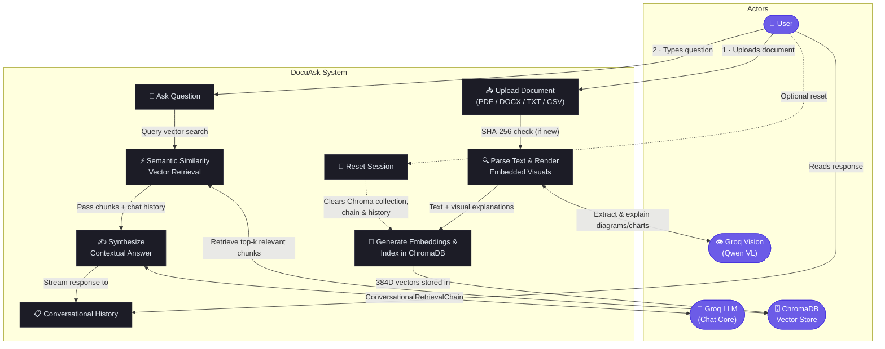

# 📑 DocuAsk

**DocuAsk** is an AI-powered document intelligence application that lets you upload complex documents and have context-aware, multi-turn conversations with their contents — powered by Groq's high-speed inference engine, LangChain's retrieval pipeline, and ChromaDB.

---

[](https://docuask.streamlit.app/)

---

## ✨ Features

- 📄 **Multi-format Document Ingestion** — Upload and analyze PDF, DOCX, DOC, TXT, and CSV files.
- 👁️ **Embedded Visual Intelligence** — Automatically detects and explains diagrams, flowcharts, UML charts, figures, and scanned pages inside PDFs and Word documents using Groq Vision (`qwen/qwen3.8-27b`).
- 🧠 **Conversational Memory** — Ask follow-up questions seamlessly with full multi-turn conversational context via `ConversationBufferMemory`.
- ⚡ **High-Speed Inference** — Sub-second response generation powered by Groq LPUs (`openai/gpt-oss-120b`).
- 🔍 **Neural Semantic Search** — High-density document chunking embedded with `sentence-transformers/all-MiniLM-L6-v2` and indexed via **ChromaDB**.
- 🔄 **Smart Session Lifecycle** — SHA-256 document hashing prevents redundant re-embedding, with one-click instant session reset.
- 🎨 **Cyberpunk Dark UI** — Custom neon HUD theme with live vector metrics, glowing telemetry badges, and glassmorphism interface cards.

---

## 🖥️ Demo

> Upload a document → Ask questions → Get context-aware answers instantly.

<p align="center">
  
</p>

---

## 🛠️ Tech Stack

| Layer            | Technology                        | Details                                              |
| :--------------- | :-------------------------------- | :--------------------------------------------------- |
| **Frontend**     | Streamlit `1.37.0`                | Custom cyberpunk dark theme & glassmorphic HUD       |
| **LLM (Chat)**   | Groq API — `openai/gpt-oss-120b`  | Ultra-fast context-grounded reasoning                |
| **Vision AI**    | Groq API — `qwen/qwen3.8-27b`     | Document diagram, chart, and visual explanation      |
| **Embeddings**   | HuggingFace — `all-MiniLM-L6-v2`  | 384-dimensional dense neural embeddings              |
| **Vector Store** | **ChromaDB** (`langchain-chroma`) | In-memory ephemeral vector database                  |
| **Framework**    | LangChain `0.2.x`                 | `ConversationalRetrievalChain`                       |
| **PDF Engine**   | `pypdf` + `pypdfium2`             | Text stream parsing & high-res visual page rendering |

---

## 📂 Project Structure

```
DocuAsk/
├── main.py                  # Main Streamlit application & RAG pipeline
├── requirements.txt         # Python dependencies
├── .env                     # Environment variables (GROQ_API_KEY)
├── .streamlit/
│   └── config.toml          # Streamlit dark theme configuration
├── .devcontainer/
│   └── devcontainer.json    # GitHub Codespaces configuration
├── assets/                  # Icons and demo preview media
├── .gitignore
└── README.md
```

---

## 🚀 Getting Started

### Prerequisites

- Python **3.9 – 3.11**
- A free [Groq API key](https://console.groq.com)

### 1. Clone the repository

```bash
git clone https://github.com/Aniruddhasain7/DocuAsk.git
cd DocuAsk
```

### 2. Create and activate a virtual environment

```bash
# Windows
python -m venv venv
venv\Scripts\activate

# macOS / Linux
python -m venv venv
source venv/bin/activate
```

### 3. Install dependencies

```bash
pip install -r requirements.txt
```

### 4. Configure environment variables

Create a `.env` file in the project root:

```env
GROQ_API_KEY=your_groq_api_key_here
```

### 5. Run the application

```bash
streamlit run main.py
```

The app will open at **http://localhost:8501** in your browser.

---

## ☁️ Run on GitHub Codespaces

This project includes a pre-configured Dev Container for instant cloud development:

1. Click **Code → Codespaces → Create codespace on main** on GitHub
2. Wait for the container to build and dependencies to install
3. The Streamlit app starts automatically on port **8501**
4. Add your `GROQ_API_KEY` to the Codespace secrets

---

## 📋 Architecture & Data Flow

The diagram below shows all actors and their interactions with the DocuAsk system.



---

### 🔑 Use Cases Explained

| #   | Use Case                        | Actor                | Description                                                                                                                     |
| --- | ------------------------------- | -------------------- | ------------------------------------------------------------------------------------------------------------------------------- |
| 1   | **Upload Document**             | User                 | Drag-and-drop or select a PDF, DOCX, TXT, or CSV file via the sidebar uploader.                                                 |
| 2   | **Process & Visual Extraction** | System ↔ Groq Vision | Extracts native text streams and detects embedded diagrams, charts, or scanned pages, generating thorough factual descriptions. |
| 3   | **Neural Indexing**             | System ↔ ChromaDB    | Chunks content (1,000 chars / 200 overlap), computes embeddings with `all-MiniLM-L6-v2`, and stores them in ChromaDB.           |
| 4   | **Ask Question**                | User                 | Enter natural-language queries about text, diagrams, data points, or tables.                                                    |
| 5   | **Retrieve Relevant Context**   | System ↔ ChromaDB    | Semantic similarity search returns the most relevant text and visual chunk embeddings.                                          |
| 6   | **Generate Answer**             | System ↔ Groq LLM    | `ConversationalRetrievalChain` combines retrieved context with conversation history to synthesize accurate responses.           |
| 7   | **Reset Session**               | User                 | Click `🔄 CLEAR & RESET SESSION` to purge active Chroma collections and start a new conversation.                               |
| 8   | **View Chat History**           | User                 | Prior question-and-answer pairs are rendered in chronological order with full conversational recall.                            |
