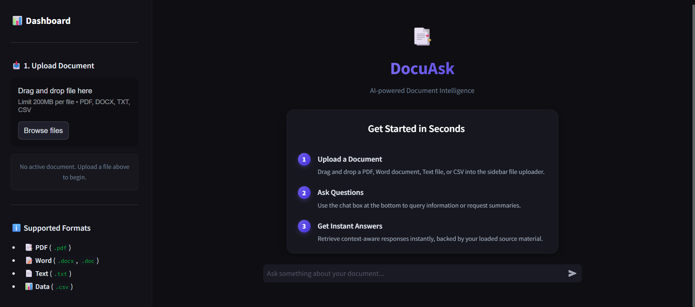
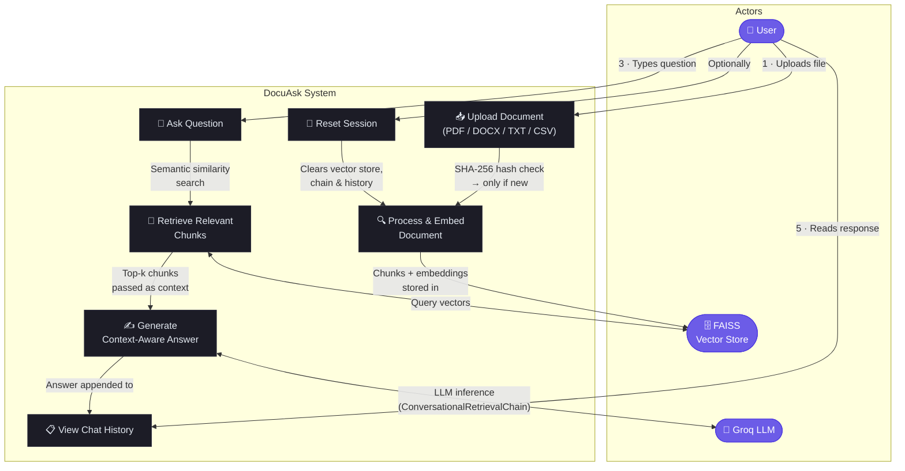

# 📑 DocuAsk

**DocuAsk** is an AI-powered document Q&A application that lets you upload a document and have a conversational chat with its contents — powered by Groq's LLM and LangChain's retrieval pipeline.

---

## ✨ Features

- 📄 **Multi-format support** — Upload PDF, DOCX, DOC, TXT, and CSV files
- 🧠 **Conversational memory** — Ask follow-up questions; the app remembers your full chat history
- ⚡ **Fast inference** — Uses Groq's blazing-fast inference API
- 🔍 **Semantic search** — Documents are chunked and embedded using `sentence-transformers/all-MiniLM-L6-v2` via FAISS vector store
- 🔄 **Smart reloading** — Documents are only reprocessed when a new file is uploaded (SHA-256 hash comparison)
- 🎨 **Premium dark UI** — Custom dark theme with animated header, glassmorphism cards, and gradient accents

---

## 🖥️ Demo

> Upload a document → Ask questions → Get context-aware answers instantly.

<p align="center">
  
</p>

---

## 🛠️ Tech Stack

| Layer        | Technology                                    |
| ------------ | --------------------------------------------- |
| Frontend     | Streamlit `1.37.0`                            |
| LLM          | Groq API — `openai/gpt-oss-120b`              |
| Embeddings   | HuggingFace — `all-MiniLM-L6-v2`             |
| Vector Store | FAISS (CPU)                                   |
| Framework    | LangChain (`ConversationalRetrievalChain`)    |
| Memory       | `ConversationBufferMemory`                    |

---

## 📂 Project Structure

```
DocuAsk/
├── main.py                  # Main Streamlit application
├── requirements.txt         # Python dependencies
├── .env                     # Environment variables (not committed)
├── .streamlit/
│   └── config.toml          # Streamlit dark theme configuration
├── .devcontainer/
│   └── devcontainer.json    # GitHub Codespaces configuration
├── .gitignore
└── README.md
```

---

## 🚀 Getting Started

### Prerequisites

- Python **3.9+**
- A valid [Groq API key](https://console.groq.com)

### 1. Clone the repository

```bash
git clone https://github.com/Aniruddhasain7/DocuAsk.git
cd DocuAsk
```

### 2. Create and activate a virtual environment

```bash
# Windows
python -m venv venv
venv\Scripts\activate

# macOS / Linux
python -m venv venv
source venv/bin/activate
```

### 3. Install dependencies

```bash
pip install -r requirements.txt
```

### 4. Configure environment variables

Create a `.env` file in the project root:

```env
GROQ_API_KEY=your_groq_api_key_here
```

### 5. Run the application

```bash
streamlit run main.py
```

The app will open at **http://localhost:8501** in your browser.

---

## ☁️ Run on GitHub Codespaces

This project includes a pre-configured Dev Container for instant cloud development:

1. Click **Code → Codespaces → Create codespace on main** on GitHub
2. Wait for the container to build and dependencies to install
3. The Streamlit app starts automatically on port **8501** and opens in a preview pane
4. Add your `GROQ_API_KEY` to the Codespace secrets

---

## 📋 How It Works

The diagram below shows all actors and their interactions with the DocuAsk system.



### 🔑 Use Cases Explained

| # | Use Case | Actor | Description |
|---|----------|-------|-------------|
| 1 | **Upload Document** | User | Drag-and-drop or select a PDF, DOCX, TXT, or CSV file via the sidebar uploader |
| 2 | **Process & Embed Document** | System | File is chunked (1,000 chars / 200 overlap), embedded with `all-MiniLM-L6-v2`, and stored in a FAISS index. Skipped if the same file is re-uploaded (SHA-256 hash comparison) |
| 3 | **Ask Question** | User | Type a natural-language question in the chat input |
| 4 | **Retrieve Relevant Chunks** | System ↔ FAISS | Semantic similarity search returns the top-k most relevant document chunks |
| 5 | **Generate Context-Aware Answer** | System ↔ Groq LLM | `ConversationalRetrievalChain` passes retrieved chunks + full chat history to Groq's LLM and streams back the answer |
| 6 | **Reset Session** | User | Clears the FAISS index, conversation chain, and entire chat history to start fresh |
| 7 | **View Chat History** | User | All prior Q&A pairs are rendered in the chat window with full conversational memory |

---

## 🤝 Contributing

Contributions, issues, and feature requests are welcome! Feel free to open an issue or submit a pull request.

---

## 📜 License

This project is open source. See the repository for license details.
